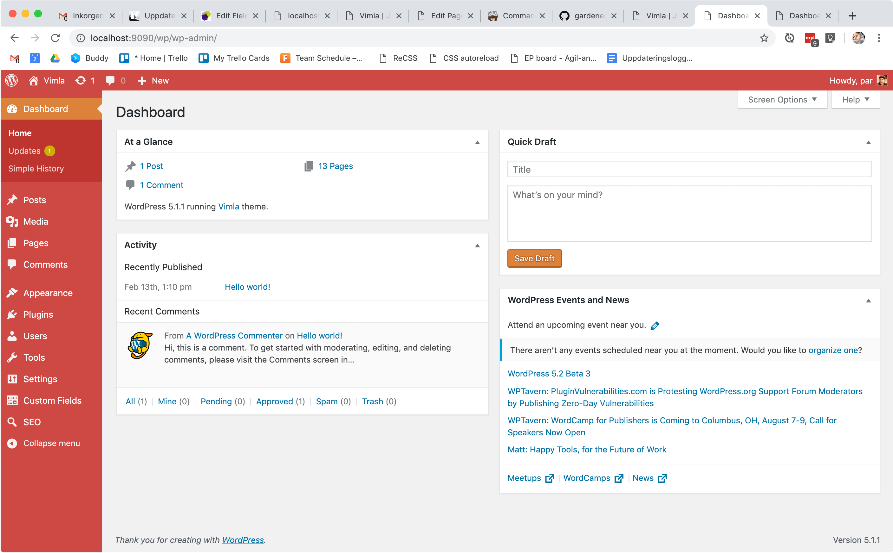
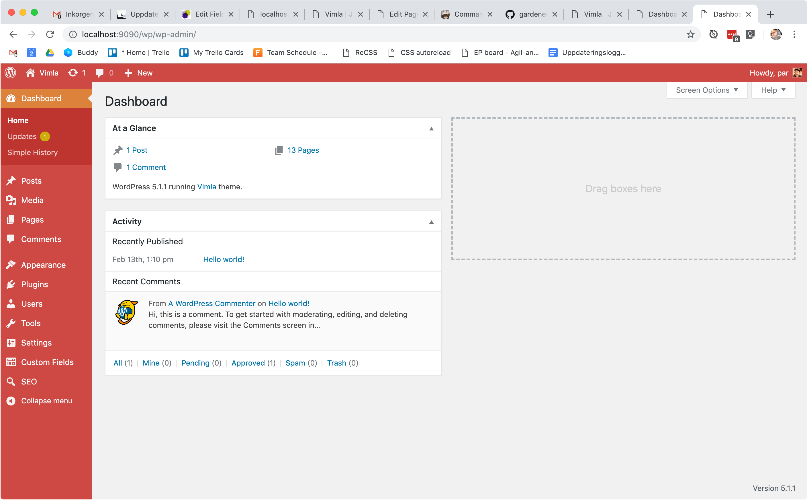

# 🏡🌳🌻 Gardener – Opinionated cleanup for WordPress

_Gardener_

> one employed to care for the gardens or grounds of a home, business concern, or other property

– https://www.merriam-webster.com/dictionary/gardener

---

**Gardener** is a WordPress plugin that adds theme support for an opinionated cleanup of the WordPress admin and frontend.

No feature is added or modified by default. Support for each feature must be added manually and if this plugin is uninstalled it will not break anything.

## Installation and usage

Install using composer:

    composer require bonny/gardener

(Or you can just [download the plugin](https://github.com/bonny/gardener/releases) and place it in your wp plugins folder.)

Add support for wanted features in your `functions.php`:

    add_theme_support('gardener-remove-emoji');
    add_theme_support('gardener-relative-links');
    add_theme_support('gardener-cleanup-upload-filenames');
    add_theme_support('gardener-cleanup-dashboard');
    add_theme_support('gardener-hide-posts');
    add_theme_support('gardener-enhance-login-screen');

## TODO

- [ ] Add all wanted features.
- [ ] Document features incl. screenshots.
- [ ] Tests would be nice.

## Features

### Relative links

    add_theme_support('gardener-relative-links');

- Change links and images added in Gutenberg and TinyMCE to use relative paths, instead of absolute.
  This is a benefit when developing a website on several domains, so you don't have to change all
  links from http://beta.example.com/ to http://example.com/.

  
Screenshot

  "Coming soon."

### Remove emoji

    add_theme_support('gardener-remove-emoji');

- Remove emoji related things.
- Removes print_emoji_detection_script, print_emoji_styles.

### Cleanup-upload-filenames

    add_theme_support('gardener-cleanup-upload-filenames');

Make file names of media attachments work better with more server configs because for example MacOS does not treat UPPERCASE or lowercase chars different, but a Linux servers will. So if you transfer uploads to a server suddenly they stop working and give you 404 errors.

When enabled this feature will

- Only keep keeping basic printable ASCII characters.
- Remove international chars like "åäö".
- Remove strange chars like `å` or `å`(they look very much like the Swedish letter `å`but they are not).
- Remove percent signs "%".
- Make file names lowercase.
- Example: instead of `/uploads/svenska tecken och mellanslag åäöÅÄÖ hej citattecken';.jpg` your file will be uploaded as `/uploads/svenska-tecken-och-mellanslag-aaoaao-hej-citattecken.jpg`. Another example is the file `Ingen-ko-på-isen-1b-2.jpg` that will be changed to `ingen-ko-pa-isen-1b-2.jpg` (Funny bonus story: the previous filename is from a real project and it was the whole reason why I started working on this feature!).

### Cleanup dashboard

    add_theme_support('gardener-cleanup-dashboard');

- Removes unwanted dashboard meta boxes, like QuickPress, plugins, recent drafts, incoming links, news and events, WPML meta box if WPML is installed.
- Removes the text "Thank you for creating with WordPress" at the bottom.

  
Screenshot

Before cleaning up dashboard

After cleaning up dashboard

### Hide posts

    add_theme_support('gardener-hide-posts');

- Hide posts links from admin menu and from admin bar (New -> Post).

### Enhance login screen

    add_theme_support('gardener-enhance-login-screen', [
        'message' => "Welcome to ACME Co website. Please login!",
        'image' => '84x84px-login-image.png',
        'image_width => 200,
        'image_height => 75,
    ]);

- Changes link to wordpress.org to a link back to the homepage of the site.
- Add support for local client image above login fields.
  - Uses image `login-client-logo.png` from theme folder if it exists, or any image using the `image` argument.
- Arguments are optional.

## Changelog

- 0.3 Use `login_headertext` instead of `login_headertitle` because `login_headertitle` is deprecated since WordPress version 5.2.0.
- 0.2.1 Add support for custom login image size.
- 0.2 Add support for feature hide posts.
- 0.1 First version
